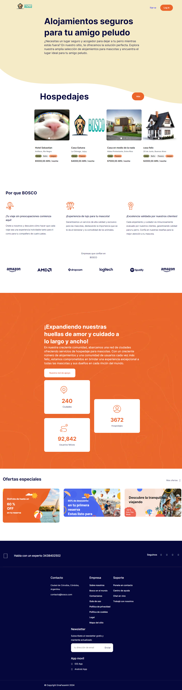
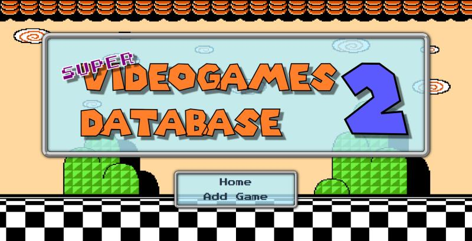
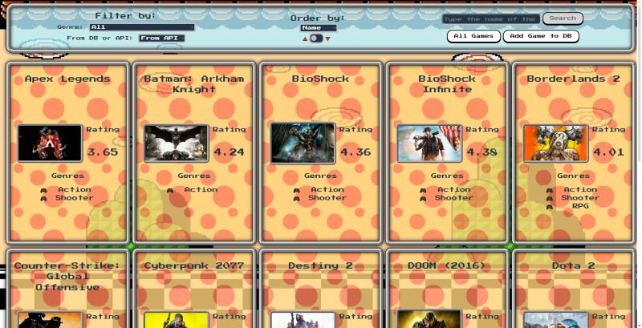
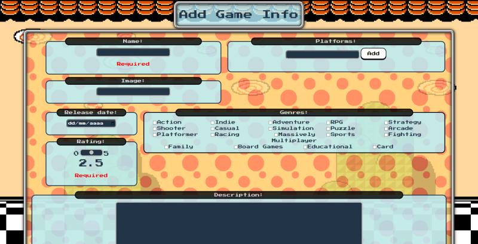

## Saludos 👋, soy Guillermo Irigoin!

Soy desarrollador web Full Stack. Desde niño siempre me movió la curiosidad y la necesidad de aprender cosas nuevas y aplicarlas en mis proyectos.

Mis estudios en ingeniería electrónica sirvieron para desarrollar y mejorar mis aptitudes para el trabajo en equipo y el análisis y resolución de problemas, así como también me proporcionaron un primer acercamiento a la programación, obteniendo una solida comprensión de algoritmos y estructuras de datos.

 

## Proyectos Recientes

### [Bosco App](https://front-bosco.up.railway.app)

Bosco es una app que permite la gestión y búsqueda de alojamiento temporal de mascotas.
Entre las funcionalidades desarrolladas los usuarios podrán registrar alojamientos en la app, así como mascotas.
Los usuarios podrán buscar alojamientos según varios criterios, como precio, ubicación, cantidad de plazas necesitadas y podrán realizar una reserva en el alojamiento seleccionado, la que luego de ser aceptada por el dueño del alojamiento podrán abonar a través de la plataforma de Mercado Pago.

<ins>**Backend:**</ins>

[Repositorio](https://github.com/Seb-astiam/back-Bosco)

Tecnologías usadas: JavaScript | NodeJS | Express | PostgreSQL | Sequelize | Socket.io | Nodemailer | Cloudinary

<ins>**Frontend:**</ins>

[Repositorio](https://github.com/Seb-astiam/front-Bosco)

Tecnologías usadas: JavaScript | NodeJS | React | Redux | Tailwind CSS | Socket.io

 

### Super Videogames Database II

Es una SPA (Single page application), que permite a los usuarios aprender u obtener información de videojuegos de diversas plataformas.

[Repositorio](https://github.com/GIrigoin/PI-Videogames)

<ins>**Backend:**</ins>
Tecnologías usadas: NodeJs | Express | PostgreSQL | Sequelize

<ins>**Frontend:**</ins>
Tecnologías usadas: React | Redux | CSS

 

## Lenguajes y tecnologías

  
  
  
  
  
  
  
  
  
  
  
  
  
  
  
  
  

 

## Contactame

---

Generated using <a href="https://profilinator.rishav.dev/" target="_blank">Github Profilinator</a>

